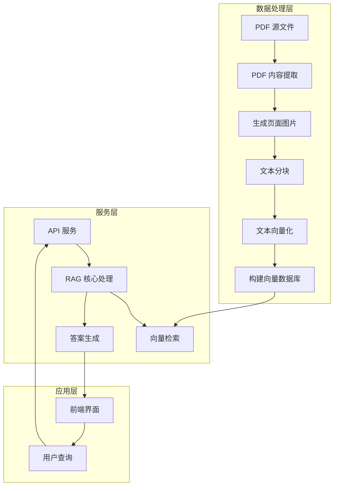

# 高中地理 RAG 系统：PDF 处理到智能问答流程

## 一、系统架构



## 二、详细处理流程

### 1. PDF 处理阶段

#### 1.1 PDF 内容提取
- **文件**：`backend/process_pdf_api.py`
- **功能**：
  - 使用 PyMuPDF 将 PDF 页面转换为图片
  - 使用 PaddleOCRVL 进行 OCR 识别
  - 提取文本和图片信息
- **输出**：
  - `materials/processed/renjiao/[教材]/pdf_extracted/pages/`：JSON 格式的页面数据
  - `materials/processed/renjiao/[教材]/pdf_extracted/markdown/`：Markdown 格式的页面数据
  - `materials/processed/renjiao/[教材]/pdf_extracted/images/`：提取的图片

#### 1.2 生成完整页面图片
- **文件**：`backend/generate_full_pages.py`
- **功能**：将 PDF 页面转换为高清 PNG 图片
- **输出**：
  - `materials/processed/renjiao/[教材]/pdf_extracted/full_pages/`：完整页面图片

### 2. 数据准备阶段

#### 2.1 文本分块
- **处理**：将长文本分割成合适大小的 chunks
- **目的**：确保语义完整性，优化向量检索效果
- **输出**：`chunks.json` 文件

#### 2.2 文本向量化
- **文件**：`backend/rag_system.py`（`embed_text` 函数）
- **功能**：使用 DashScope text-embedding-v4 模型
- **输出**：`embeddings.json` 文件（1024 维向量）

#### 2.3 构建向量数据库
- **文件**：`backend/rag_system.py`（ChromaDB）
- **功能**：
  - 创建持久化向量数据库
  - 存储文本 chunks、向量和元数据
  - 建立索引
- **输出**：
  - `materials/processed/renjiao/[教材]/vector_db/`：向量数据库文件

### 3. RAG 使用阶段

#### 3.1 API 服务
- **文件**：`backend/api.py`
- **功能**：提供 HTTP 接口
- **端点**：
  - `POST /api/search`：搜索相关文档
  - `POST /api/generate`：生成回答（流式）
  - `GET /materials/*`：访问静态文件（PDF 页面图片）

#### 3.2 核心 RAG 处理
- **文件**：`backend/rag_system.py`
- **流程**：
  1. **查询重写**：使用 Qwen-Max 优化用户问题
  2. **向量检索**：从 ChromaDB 检索相关文档
  3. **重排序**：结合基础分和 LLM 评分
  4. **流式生成**：基于检索结果生成回答

## 三、技术栈

| 类别 | 技术/库 | 用途 |
|------|---------|------|
| **后端框架** | FastAPI | API 服务 |
| **PDF 处理** | PyMuPDF | PDF 转换为图片 |
| **OCR** | PaddleOCRVL | 文本和图片识别 |
| **向量数据库** | ChromaDB | 向量存储和检索 |
| **向量化** | DashScope text-embedding-v4 | 文本向量化 |
| **大模型** | Qwen-Max | 查询重写、重排序、生成回答 |
| **前端** | Vue 3 | 用户界面 |

## 四、文件结构

```
RAG_Geography/
├── backend/
│   ├── api.py                # API 接口
│   ├── rag_system.py         # RAG 核心系统
│   ├── process_pdf_api.py    # PDF 处理
│   ├── generate_full_pages.py # 生成页面图片
│   └── requirements.txt      # 依赖配置
├── frontend/
│   ├── src/                  # 前端代码
│   └── package.json          # 前端依赖
├── materials/
│   ├── textbooks/            # 原始 PDF 教材
│   └── processed/            # 处理后的文件
│       └── renjiao/          # 人教版
│           ├── bixiu_1/      # 必修第一册
│           │   ├── pdf_extracted/  # OCR 结果
│           │   └── vector_db/      # 向量数据库
│           └── bixiu_2/      # 必修第二册
└── .env                      # 环境变量配置
```

## 五、使用流程

### 5.1 数据处理流程
1. 准备 PDF 教材文件到 `materials/textbooks/`
2. 运行 `process_pdf_api.py` 进行 OCR 处理
3. 运行 `generate_full_pages.py` 生成页面图片
4. 系统自动完成文本分块、向量化和数据库构建

### 5.2 服务启动流程
1. 启动后端服务：`python -m uvicorn api:app --reload --host 0.0.0.0 --port 8000`
2. 启动前端服务：`npm run dev`
3. 访问前端界面：http://localhost:5173

### 5.3 用户使用流程
1. 在前端输入地理问题
2. 系统检索相关教材内容
3. 生成基于教材的详细回答
4. 显示参考资料和页面图片

## 六、核心功能特点

### 6.1 智能检索
- **查询重写**：优化用户问题，提高检索效果
- **向量检索**：基于语义相似度的高效检索
- **重排序**：结合多种评分机制，提升结果质量

### 6.2 高质量回答
- **基于教材**：回答内容来源于教材，保证准确性
- **流式输出**：实时显示生成过程，提升用户体验
- **教学风格**：采用适合高中生的讲解方式

### 6.3 多模态支持
- **文本识别**：提取 PDF 中的文字内容
- **图片提取**：识别和保存教材中的图片
- **页面预览**：查看原始教材页面

## 七、应用场景

- **学习辅助**：帮助学生理解地理概念和知识点
- **教师备课**：快速检索教材内容，辅助教学设计
- **自主学习**：学生自主查询和复习地理知识
- **知识巩固**：通过问答形式加深对知识点的理解

## 八、系统优势

1. **教材准确**：基于正版教材内容，保证知识的正确性
2. **智能检索**：结合向量检索和 LLM 重排序，提高相关度
3. **流式生成**：实时显示回答过程，提升用户体验
4. **多模态支持**：支持文本和图片的综合处理
5. **易于扩展**：模块化设计，支持添加新教材和功能

---

**总结**：本系统通过先进的 RAG 技术，将传统纸质教材转化为智能问答系统，为地理学习提供了一种全新的交互方式，既保证了知识的准确性，又提升了学习的趣味性和效率。